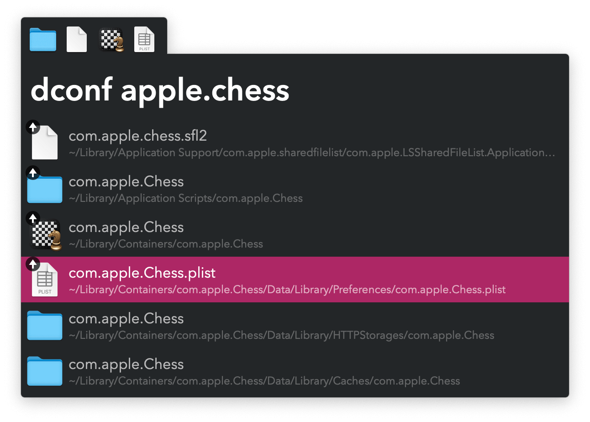

#  Delete Configuration Alfred Workflow

Find settings and preferences to delete

[⤓ Install on the Alfred Gallery](https://alfred.app/workflows/vitor/delete-configuration)

## Usage

Find files and folders in `~/Library` via the `dconf` keyword. <kbd>↩&#xFE0E;</kbd> to add to the File Buffer.

