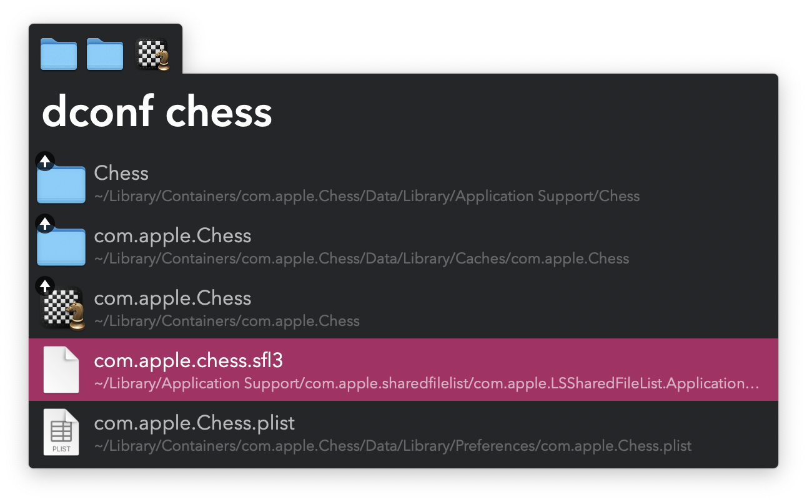

#  Delete Configuration Alfred Workflow

Find settings and preferences to delete

[⤓ Install on the Alfred Gallery](https://alfred.app/workflows/vitor/delete-configuration)

## Usage

Find files and folders in `~/Library` via the `dconf` keyword.

* <kbd>↩&#xFE0E;</kbd>: Delete path.
* <kbd>⌘</kbd><kbd>↩&#xFE0E;</kbd>: Ignore path during this run.
* <kbd>⇧</kbd><kbd>↩&#xFE0E;</kbd>: Add path to the [File Buffer](https://www.alfredapp.com/help/features/file-search/#file-buffer).
